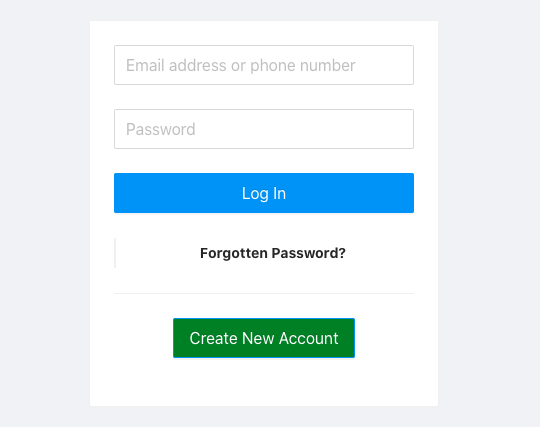

# Login Demo

[-@2x.png)](http://loopback.io/)

# Getting Started
We need to start the node server
```shell script
$ npm install
$ npm start
``` 
This will start the node server on port 30001

```
Server is running at http://127.0.0.1:3001
Try http://127.0.0.1:3001/ping
```

Next we need to start the frontend which is in react
```shell script
$ cd ui-app
$ npm install
$ npm start
```
This will start the react on port 3000
```
You can now view ui-app in the browser.

  Local:            http://localhost:3000
  On Your Network:  http://10.186.60.6:3000

```
Opening the url will show the login screen
Here are the sample users data
```
[
  {name: 'Alice', email: 'alice@example.com', password: 'alice123', phone: '9999999999'},
  {name: 'Bob', email: 'bob@example.com', password: 'bob123', phone: '8888888888'},
  {name: 'Eve', email: 'eve@example.com', password: 'eve123', phone: '7777777777'},
]
```


